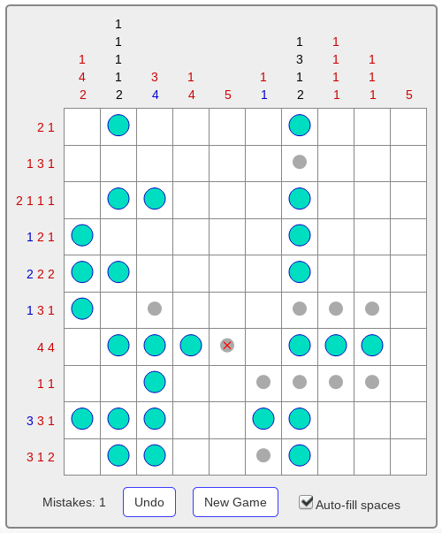

+++++++++++++++++++++
React Nonogram README
+++++++++++++++++++++

|license|

.. |license| image:: https://img.shields.io/badge/License-MIT-yellow.svg
   :target: https://en.wikipedia.org/wiki/MIT_License
   :alt: MIT Licensed

React Nonogram is a `nonogram puzzle`_ application written in React_, similar to
the official `React Tutorial`_ tic-tac-toe app, but more interesting.

`Play it now! <play_>`_

.. _nonogram puzzle: https://en.wikipedia.org/wiki/Nonogram
.. _React: https://reactjs.org/
.. _React Tutorial: https://reactjs.org/tutorial/tutorial.html
.. _play: http://smbolton.com/nonogram/index.html

Installation
============
React Nonogram was bootstrapped with `create-react-app`_, so building it is
pretty straightforward if you have `node installed`_:

.. _create-react-app: https://github.com/facebookincubator/create-react-app
.. _node installed: https://nodejs.org/en/download/

.. code:: shell

   $ git clone https://github.com/smbolton/react-nonogram.git
   $ cd react-nonogram
   $ npm install
   $ npm start  # if you wish to run the development server
   $ npm run build

Copy the resulting files in the ``build`` subdirectory to an appropriate place
on your web server, and React Nonogram should be ready to run.

License
=======
Copyright © 2017 Sean Bolton.

Permission is hereby granted, free of charge, to any person obtaining
a copy of this software and associated documentation files (the
"Software"), to deal in the Software without restriction, including
without limitation the rights to use, copy, modify, merge, publish,
distribute, sublicense, and/or sell copies of the Software, and to
permit persons to whom the Software is furnished to do so, subject to
the following conditions:

The above copyright notice and this permission notice shall be
included in all copies or substantial portions of the Software.

THE SOFTWARE IS PROVIDED "AS IS", WITHOUT WARRANTY OF ANY KIND,
EXPRESS OR IMPLIED, INCLUDING BUT NOT LIMITED TO THE WARRANTIES OF
MERCHANTABILITY, FITNESS FOR A PARTICULAR PURPOSE AND
NONINFRINGEMENT. IN NO EVENT SHALL THE AUTHORS OR COPYRIGHT HOLDERS BE
LIABLE FOR ANY CLAIM, DAMAGES OR OTHER LIABILITY, WHETHER IN AN ACTION
OF CONTRACT, TORT OR OTHERWISE, ARISING FROM, OUT OF OR IN CONNECTION
WITH THE SOFTWARE OR THE USE OR OTHER DEALINGS IN THE SOFTWARE.
